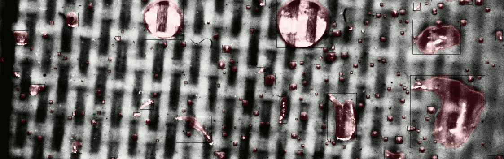

# Resin Bubble Identification Using Mask R-CNN 

The Resin Bubble project identifies bubbles against a carbon fiber background in resin cure images. Identification is achieved using Mask R-CNN instance segmentation as implemented in [detectron2](https://github.com/facebookresearch/detectron2/blob/master/INSTALL.md). Resin Bubble scripts generate image masks, visualizations, animations, plots, and a JSON file that specifies bubble locations and areas. If the pre-trained Mask R-CNN model fails to identify bubbles of interest in your tests, a simplified interface for model training is provided to facilitate identification of new bubble types.

<div align="center">
  
</div>

## Table of Contents

- [Installation](#installation)
- [Bubble Identification (Prediction)](#bubble-identification-prediction)
  * [Prediction Output](#prediction-output)
- [Model Training](#model-training)
  * [Updating the Default Model](#updating-the-default-model)
  * [Training a New Model](#training-a-new-model)
  * [Creating Training Masks](#creating-training-masks)
  * [Resolving Memory Errors During Training](#resolving-memory-errors-during-training)
- [General Troubleshooting](#general-troubleshooting)

## Installation

#### Requirements

- Linux or MacOS
- [Git Large File Support](https://git-lfs.github.com/)
- Python >= 3.7
- pip3
- GCC >= 4.9

#### Installation Steps

1. Install detectron2 and its dependencies.

    ```
    pip3 install torch torchvision opencv-python cython shapely
    pip3 install -U git+https://github.com/facebookresearch/fvcore
    pip3 install git+https://github.com/facebookresearch/detectron2.git
    pip3 install git+https://github.com/cocodataset/cocoapi.git#subdirectory=PythonAPI
    ```
 
2. Clone the resin_bubble repository using LFS. The repository contains command line interface scripts, the resin_bubble Python package, a pretrained model, and training data.

    ```
    git lfs clone https://github.com/floidgilbert/resin_bubble.git
    ``` 

3. Change directories to the `resin_bubble` directory to use the command line interface (CLI). There is no need to install the included Python package unless you plan on using its components in your own scripts.

    ```
    cd resin_bubble
    ``` 

## Bubble Identification (Prediction)

The Resin Bubble predictor is designed to process a batch of images taken during a resin cure test. Bubbles can be identified in PNG, JPG, TIFF, and BMP images. Image file names should contain a time stamp or index such that alphabetical order corresponds to temporal order. This order is used to generate meaningful sequences in plots and animations.  

One or more CUDA-compatible 16GB GPUs are recommended for prediction. Prediction on CPU is also supported, but processing may take 1.6 minutes per 2448x2048 image. If you don't have a GPU, free compute resources are available online through [Kaggle](https://www.kaggle.com/) and [Google Colab](https://colab.research.google.com/). Low-cost compute resources are available through [Google Cloud Platform](https://cloud.google.com/) and [Amazon Web Services](https://aws.amazon.com/).

Parallel processing is supported if multiple CPUs, or multiple CPUs and GPUs, are available. By default, the prediction script uses all available processors and GPUs. See the command line interface (CLI) documentation for parameters that limit the number of devices. 

'Out of Memory' errors may occur if the target images are very large. In this case, divide the images into separate files. Resizing images is not recommended for bubble identification because small details can be lost.

The following command identifies bubbles in the included test images using a pre-trained Mask R-CNN model. To identify bubbles in your own images, change the `--input` and `--output` parameters to point to different source and destination directories, respectively.

```
python3 predict.py \
    --input ./data/test-00 \
    --output ./data/test-00-output
```

Additional CLI parameters are available for filtering bubbles, specifying one or more custom models, limiting resources, and various other options. For more information, see the CLI documentation:

```
python3 predict.py --help
``` 

### Prediction Output

The output directory contains the following files and directories.

- `mask/` - Directory containing masks.
- `viz/` - Directory containing prediction visualizations (the original images overlayed by masks). Be default, the images are equalized to enhance contrast.
- `viz-rect/` - Directory containing prediction visualizations with bounding rectangles.
   - Black rectangles - Retained instances
   - Red rectangles - Instances filtered by minimum area. The default minimum area is 10 pixels.
- `info.json` - Bubble location, area, and filtering information for each mask.
- `mask.avi` - Animation of masks.
- `plot*.png` - Various plots of bubble counts and area. 
- `viz.avi` - Animation of visualizations. Each frame displays the corresponding image file name in the upper-left corner.
- `viz-rect.avi` - Animation of visualizations with rectangles. Each frame displays the corresponding image file name in the upper-left corner.

## Model Training

If the pre-trained model fails to correctly identify bubbles of interest in your tests, a CLI is provided to train a model. Two training approaches are outlined in the following sections. A CUDA-compatible 16GB GPU is required for training. Multi-GPU training is supported.

For a complete list of training parameters, see the CLI documentation. Experienced detectron2 practitioners can specify additional parameters via `./configs/resin_bubble.yaml`.

```
python3 train.py --help
```

### Updating the Default Model

This approach involves tuning the pre-trained model included with the Resin Bubble project to recognize new bubble instances. This approach is recommended if the model is predicting most bubbles correctly. The advantage to this approach is that it usually takes less time and resources. The disadvantage is that it can bias the model. If this method fails to achieve the desired results, see [Training a New Model](training-a-new-model).

1. Use the default model to generate masks for the images in your test.

2. Using the visualizations in the prediction output, identify a few images that contain typical errors. Copy the corresponding masks to an empty directory. Copy the corresponding original images to a separate empty directory.

3. Update the masks, and original images if necessary, using the guide [Creating Training Masks](#creating-training-masks)

4. Use the following command as a template to train the model. Replace tokens (items surrounded by angled brackets) with the appropriate values. For `<iterations>`, take the number of mask images you modified in the previous step and multiply that number by 50. For example, if you have five images, replace `<iterations>` with 250. During execution, watch the training output. By the end, `loss_mask` should be consistently close to 0.15. If not, try increasing the number of iterations.

    ```
    python3 -m torch.distributed.launch train.py \
        --input <input directory> \
        --masks <mask directory> \
        --output ./models/00 \
        --iterations <iterations> \
        --weights ./models/default.pth
    ```   

6. The new model is `./models/00/model_final.pth`. Use this model to generate new predictions. For example:

    ```
    python3 predict.py \
        --input <input directory> \
        --output <output directory> \
        --models ./models/00/model_final.pth
    ```

### Training a New Model

This section outlines training a new model using new and existing training data together. This approach is appropriate when the pre-trained model fails to identify a large number of instances in your tests. This approach is also less susceptible to bias.

1. Use the default model to generate masks for the images in your test.

2. Using the visualizations in the prediction output, identify a few images that contain typical errors. Copy the corresponding masks to `./data/train`. Copy the corresponding original images to `./data/train/mask`. These directories contain the original images/masks used to train the default model.

3. Update the masks, and original images if necessary, using the guide [Creating Training Masks](#creating-training-masks)

4. Use the following command as a template to train the model. The training routine will print several metrics to the console. If `loss_mask` is consistently less than 0.15 when the task finishes, increase the iterations parameter by 1000 or 2000, and execute the command again.  

    ```
    python3 -m torch.distributed.launch train.py \
        --input ./data/train \
        --masks ./data/train/mask \
        --output ./models/01 \
        --iterations 3000 \
        --resume
    ```

5. The new model is `./models/01/model_final.pth`. Use this model to generate new predictions as shown below.

    ```
    python3 predict.py \
        --input <input directory> \
        --output <output directory> \
        --models ./models/01/model_final.pth
    ```

### Creating Training Masks

In computer vision, image annotation is the process of identifying and labeling objects of interest in images. This project uses image masks to identify objects. A mask is an image with two colors: usually black and white. Black indicates the background areas and white indicates bubbles. These masks are used to train the model to differentiate between bubbles and the background. Hence, every image that we use in training has an associated mask.

There are several applications designed specifically for machine learning image annotation. However, if you are new to this process, it might be easier to use an image editor such as the freely available GIMP2. Whatever method you select, make sure the application has some tool for painting pixels using a brush of some kind. Applications that feature only vector shapes like rectangles or ellipses are not accurate enough for bubble identification.

Here is a general description of the annotation process. For each image/mask combination, overlay the mask onto the original image as a separate layer. Set black as the background/transparent color for the mask layer so the original image shows through. On the mask layer, paint areas white that correspond to bubbles on the original image. Try to be consistent as possible across bubbles and between images. Finally, export the updated mask layer, overwriting the original mask image as a PNG file.

**TIP:** Resin Bubble automatically equalizes images during training and prediction. To see what the model "sees," apply the 'auto-equalize' feature in an image utility before annotating. You will find that previously unseen bubbles will become visible.

**TIP:** Sometimes it is impractical to accurately annotate (create masks for) all of the bubbles in an image when there many small bubbles. However, if the unannotated bubbles are similar to bubbles of interest, they will reduce the accuracy of the model. This problem can be addressed by simply erasing sections of the original image where there are too many bubbles. When erasing around an annotated bubble, try to leave as much margin as possible.

### Resolving Memory Errors During Training

'Out of Memory' errors (or other memory-related error messages) usually indicate that the size of your images are too large for your GPU. This error can be avoided by adjusting the crop settings. During training, a random image crop is taken at each iteration. The size of the cropped area can be adjusted by adding the following parameter to the training command line.

```
INPUT.CROP.SIZE '(0.80, 0.80)'
```

Replace the default values with any decimal values in the interval [0, 1] that indicate the crop height and width relative to the original image size. Reduce the crop size to avoid memory errors. If you reduce the crop size significantly, you may need to increase the number of iterations during training time to maintain the appropriate accuracy level (e.g., `loss_mask` consistently around 0.15).

If you still experience memory errors after reducing the crop size, try increasing the computer's RAM. 

## General Troubleshooting

The Resin Bubble project uses [PyTorch](https://pytorch.org/) for machine learning. If a task is interrupted unexpectedly either by the user or a runtime error, PyTorch does not always terminate all child processes. If you are unable to run a new task after a previous tasks aborts, try manually terminating the related processes. For example, `pkill python` will terminate all Python tasks.

As of this writing, detectron2 does not handle training images that contain zero instances.

If progress bars do not appear correctly in the terminal, change the terminal encoding to UTF-8.
 